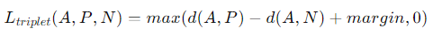

### Instructions

- This notebook has been guided by the following [https://medium.com/@ageitgey/machine-learning-is-fun-part-4-modern-face-recognition-with-deep-learning-c3cffc121d78]

### Description
- pratice-train.ipynb, we will train a face recognition model on a set of images. Step by step, we will:
    - Detect faces in the images with cascade classifier in OpenCV.
    - Align the faces using a landmark detection model in dlib (shape predictor), aligned by center of eyes.
    - Normalize the faces 0-1 from divided by 255.
    - Use PCA to reduce the dimensionality of the faces, and train a Support Vector Machine (SVM) to recognize the faces.
    - Save the trained model to disk.

##### Attention: Before training the model, we can use facenet to extract the features of the faces replacing the PCA. The model will be trained with the features extracted by facenet.[https://www.cv-foundation.org/openaccess/content_cvpr_2015/app/1A_089.pdf]

- In face_process.py, we will create a class to process images:
    - Detect faces in the images with cascade classifier in OpenCV.
    - Align the faces using a landmark detection model in dlib (shape predictor), aligned by center of eyes.
    - Drop black padding from the aligned faces.

- In predict-new.ipynb, we will use the trained model to predict faces in a new image.

### Data train for triplet loss

- The data train for triplet loss is in the website [https://www.kaggle.com/datasets/selfishgene/youtube-faces-with-facial-keypoints]

- This is a dataset of YouTube faces with facial keypoints. The facial keypoints include the following:
    - colorImages
    - boundingBox
    - landmarks2D
    - landmarks3D

- Triplet loss follow:
    - A triplet is composed by an anchor, a positive and a negative example. The anchor and the positive are the same person, and the negative is a different person.
    - The loss function is defined by the following equation:
        
    - Where:
        - A is the representation of the Anchor image. (Vector of features extracted by model)
        - P is the representation of the Positive image (from the same class as the Anchor). (Vector of features extracted by model)
        - N is the representation of the Negative image (from a different class than the Anchor). (Vector of features extracted by model)
        - alpha is a margin that separates the positive and negative examples.
        - d(A,P) is the euclidean distance between the feature vectors of the examples A and P.
